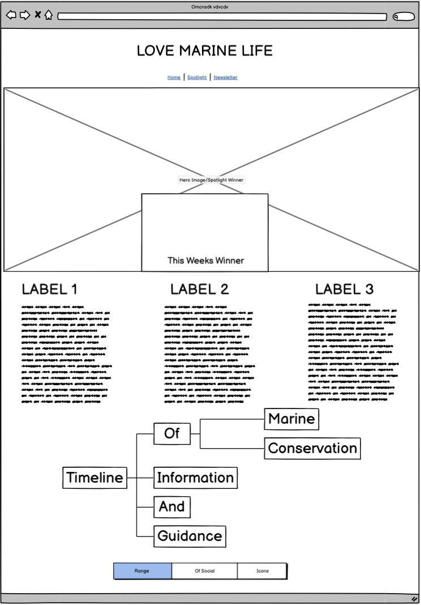
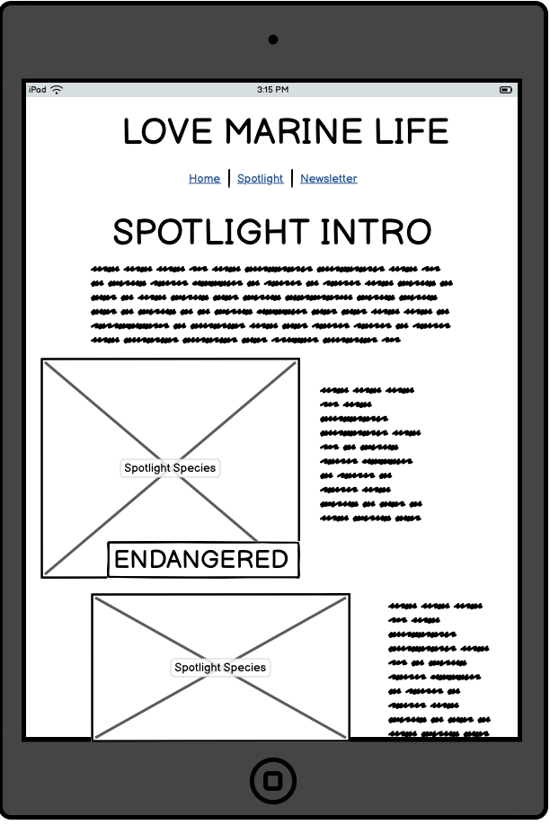
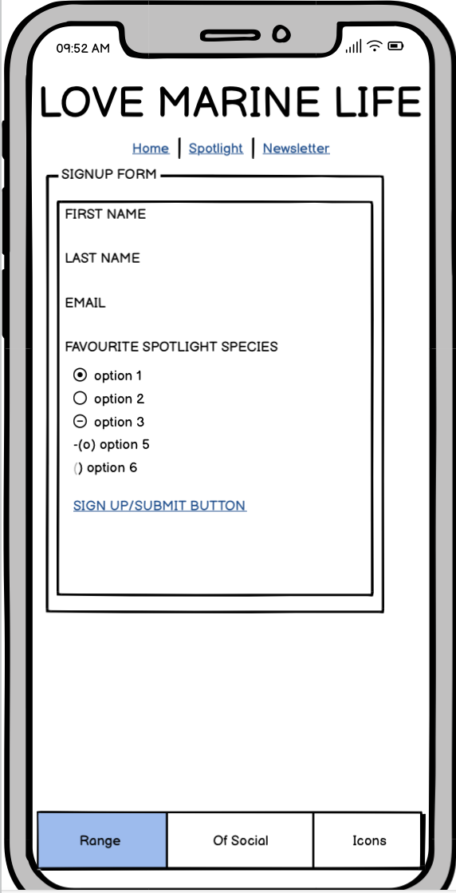

# 'LOVE MARINE LIFE'

### JAMES RICHARDS
---

## UX
### Project Goals
---

The utltimate goal of this project is to increase and promote awareness of marine life species and the effect/impact of marine pollution as well as marine conservation. It also allows the user to partake by voting for their weekly favourite spotlight species - affecting the colour scheme of the projects design that week

---

### User Goals
---
The target user for this project are marine life enthusaits, activist and environmentalists. The primary user golas for this porject are as follows:

- Broaden knowlegde of marine life facts
- Understand which species are classed as endangered
- Understand what endangerment is
- Learn about marine pollution
- Obtain guidance on how to contribut towards marine conservation
---
### Devleoper and Business Goals

---
The primary developer/business goal for this project are to increase and promote awareness about marine life and conservation to the user. Other goals surround the following:

- Persuade the user to enagage in marine conservation
- Present the user with updates and information to their mailbox
- Provide the user the opportunity to have an impact on the devleopment of the project (spotlight feature)
---
### Design Choices
Design choices forn this project are focused around two font familys and a current color scheme. However as mentioned in the primary project goals, these themes are theoretically subject to change. Current design choices are as follows: 

- Font family 1: Raleway - Raleway was chosen because of its sleek and proffesional strcutre, proving a minimilaist desing reflecting clarity of the websites goals

- Font family 2: Neon - Neon was chosen because it subtely complimented the stroke desing of raleway, clearly depicting itself as a different font whilst not being a noticeably drastic different desing choice

- Colour Choice 1: Orange (#ff7d00) - Currently  given to any non h2 body text as its acts as a complimenting hue to spotlight winner/h2 yellow theme

- Colour Choice 2: Yellow (#ffeb00) - Currently selected to relfect the colour of the Yellow Tang fish advertised as the websites spotlight winner, as per the sites advertised feature

- Background Colour Choice: Black - Currently the backgorund colour has been set to black in order to better emphasisze the brighter colours chosen for the foreground text. White or BLack shades will only be used to help increase the range of contrast visibility

---
### Wireframes

Wireframes are as follows, be aware they do not represent a fully accurate final design of the project: 

---
## Features
### Exisiting Features
Current features oif this project surround the following:

- Navigation Menu
- Singup Form Including Multiple Choice Options
- Range of Icons used form the Font Awesome website (See 'Credits')
- Range of Fonts used form the Google Fonts website (See 'Credits')
- Range of Images used form the Unsplash website (See 'Credits')

---
### Features Left to Impliment
 Remaining features to impliment on the development of this project include but are not limited to:

- Hamburger Menu
---
## Technology

The links to the technology and resources used to support this project can be found in the CREDITS section. Technologies used include: 

- Github for hosting the repository for this code
- Gitpod for hosting the server and production of this code
- Font Awesome for supply of i class elements and visual icon library
- Google Fonts for the import of the used fonts
- Unsplash for the library of royalty-free stock images
- iStock for a library of royalty-free stock images 
- Balsamiq for desktop used to template design the wireframes available in this README

---
## Testing and Deployment
### How to Run this Project Locally
---
### How to Run this Project Externally
---
## Credits
### Content

[A Link to Font Awesome](https://fontawesome.com/) 
[A Link to GooggleFonts](https://fonts.google.com/) 

---
### Media

[A link to Unsplash](https://unsplash.com/) 
[A Link to iStock](https://www.istockphoto.com/) 
[A link to Balsamiq](https://balsamiq.com/)

---
### Code

[A Link to GitHub](https://github.com/)  
[A Link to GitPod](https://www.gitpod.io/)  

---
### Acknowledgements
Acknowledgements towards external or third party resources which were refrecned for support towards the devleopment of this project are as follows: 
 
 1. [The W3C CSS Validation Service](https://jigsaw.w3.org/css-validator/)
 2. [The W3C HTML Validation Servcie](https://validator.w3.org/)
 3. [WebAIM Contrast Checker](https://webaim.org/resources/contrastchecker/)
 4. [FlexFroggy: A Game for Learning CSS Flex](https://flexboxfroggy.com/)
 5. [W3BSchools: HTML Color Values](https://www.w3schools.com/html/html_colors_hex.asp)
6. [Code Institute LMS](https://learn.codeinstitute.net/dashboard)
---

